# Arquitectura

Cómo está construido el servidor por dentro: qué pieza hace qué, cómo se
comunican y por qué están separadas así.

Este documento es para **quien va a tocar el código**. Si querés entender qué es
un MCP o qué es un embedding sin entrar al código, empezá por
[`CONCEPTOS.md`](CONCEPTOS.md). Si querés saber qué preguntarle al servidor,
andá a [`COMO_FUNCIONA.md`](COMO_FUNCIONA.md).

---

## 1. La idea en un diagrama

El servidor se sienta entre el agente y tres recursos externos. No tiene base de
datos propia de negocio, no tiene usuarios, no tiene estado de sesión. Es un
traductor con memoria.

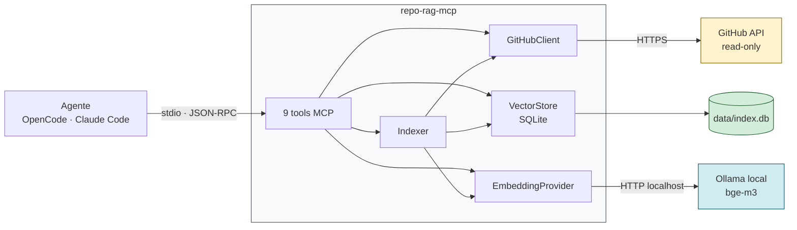

Tres cosas que este diagrama ya dice y conviene fijar:

1. **Hacia GitHub solo salen lecturas.** No hay un cliente de escritura en
   ningún lado del código. La interfaz `GitHubClient` (`src/github/types.ts`)
   expone seis métodos y los seis empiezan con `get` o `list`. Esa restricción
   no es una convención: es la forma del tipo.
2. **Lo único que se escribe es `data/index.db`**, en tu máquina.
3. **Ollama es local.** Ningún texto de los repos sale hacia un servicio de
   terceros para ser embebido.

---

## 2. Las dos mitades del sistema

Acá está la distinción que más cuesta al leer el código por primera vez, y sin
la cual nada del resto se entiende:

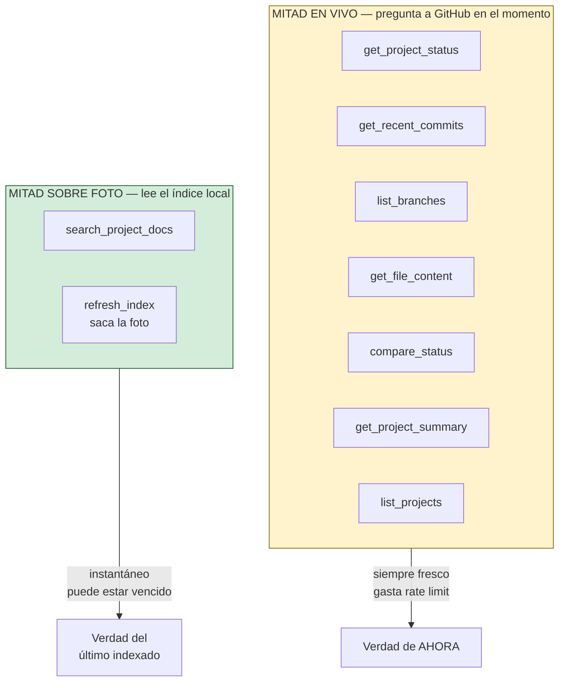

**El índice es una foto, no un espejo.** Es la fuente número uno de confusión
para alguien que no construyó esto: pregunta por un documento que está en
GitHub, y se le contesta que la documentación no lo cubre. La respuesta no está
mal — el documento no estaba en la foto.

Esa es la razón de ser del auto-index del arranque (sección 5): no documenta el
paso manual, lo elimina.

---

## 3. Mapa de módulos

Quién depende de quién. Las flechas van en la dirección de la dependencia.

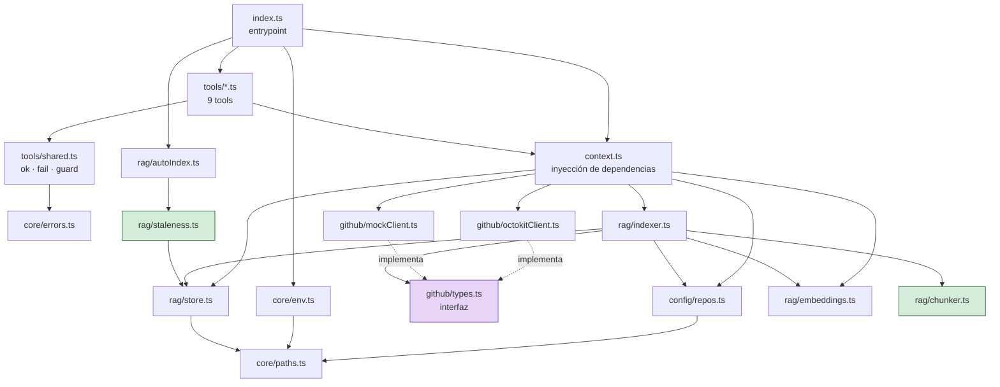

Dos nodos están marcados a propósito:

- **`github/types.ts` (violeta)** es una interfaz, no una implementación. Ahí
  está el desacople que permite que toda la suite de tests corra **sin red y sin
  token**: `MockGitHubClient` implementa la misma interfaz en memoria. El
  cableado se decide en un solo lugar, `context.ts`, mirando `REPO_RAG_MODE`.

- **`rag/staleness.ts` y `rag/chunker.ts` (verde)** son **funciones puras**. No
  tocan disco, no tocan reloj, no tocan red. `selectStaleRepos(repos, stats,
  maxAgeHours, now)` recibe hasta el reloj como argumento. Por eso un test puede
  plantear un escenario completo con tres literales, sin levantar SQLite ni
  Ollama. Los efectos — leer `index_runs`, mirar la hora, gastar cuota de GitHub
  — viven en el scheduler que la llama, no en la decisión.

Esa separación entre **decidir** y **ejecutar** es el patrón que se repite en
todo el proyecto. Si vas a agregar lógica, preguntate de qué lado cae.

---

## 4. Arranque del servidor

`src/index.ts` de arriba a abajo:

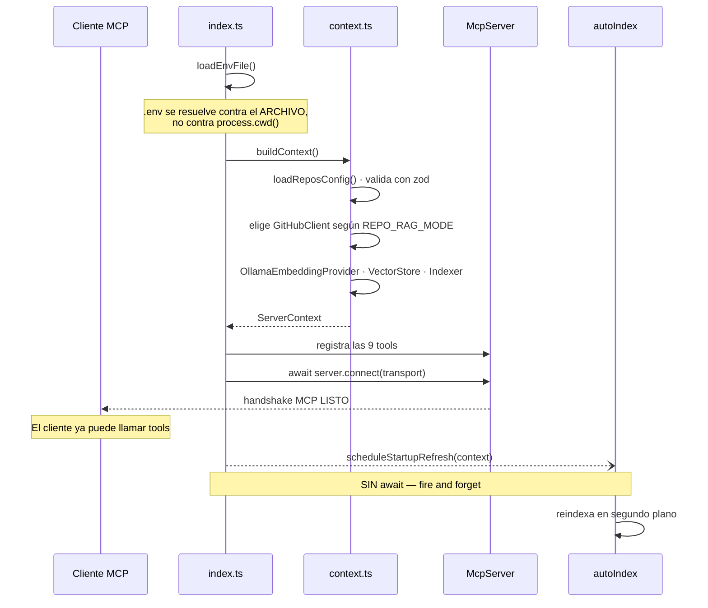

### Por qué el `.env` se resuelve contra el archivo

`core/paths.ts` calcula `PROJECT_ROOT` desde `import.meta.url`, no desde
`process.cwd()`. Motivo concreto: el cliente MCP arranca el servidor desde el
repo en el que vos estés trabajando en ese momento. Un lookup relativo al cwd
buscaría el `.env` en el proyecto equivocado y no lo encontraría nunca. Además,
los clientes MCP lanzan el proceso por stdio **sin shell**, así que el entorno
del padre suele venir vacío: el `.env` de al lado del servidor es la
configuración real.

### Por qué el auto-index NO se espera

La línea es `void scheduleStartupRefresh(context).catch(...)`, deliberadamente
sin `await`. Si se esperara, el handshake MCP quedaría colgado de GitHub y de
Ollama, y un arranque en frío dejaría al cliente esperando minutos.

Sin `await`, las tools contestan desde el índice viejo mientras la actualización
corre por detrás. Un servidor que contesta con un índice vencido es muchísimo
mejor que uno que no arranca.

Esa misma prioridad explica las **tres capas de red de contención**:

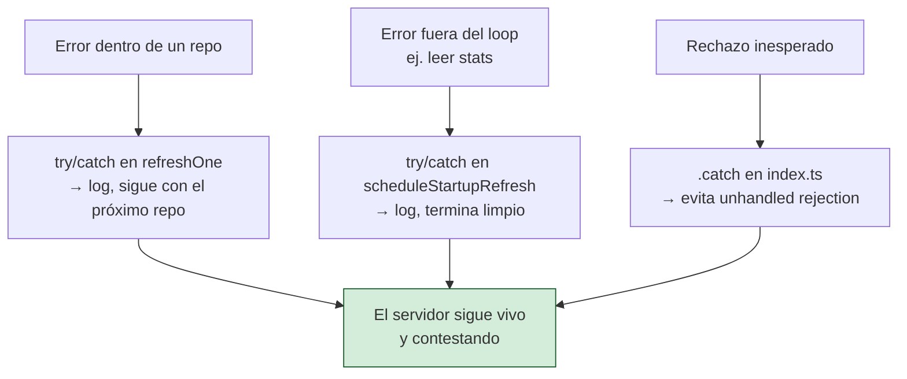

Y el motivo de que los repos se procesen **en secuencia y nunca con
`Promise.all`**: paralelizar multiplicaría la presión sobre el rate limit de
GitHub y sobre Ollama justo en el momento en que el agente empieza a preguntar,
sin ganar nada, porque esto ya corre en segundo plano.

---

## 5. Qué se considera "vencido"

`selectStaleRepos` decide **por repo**, no con un flag global:

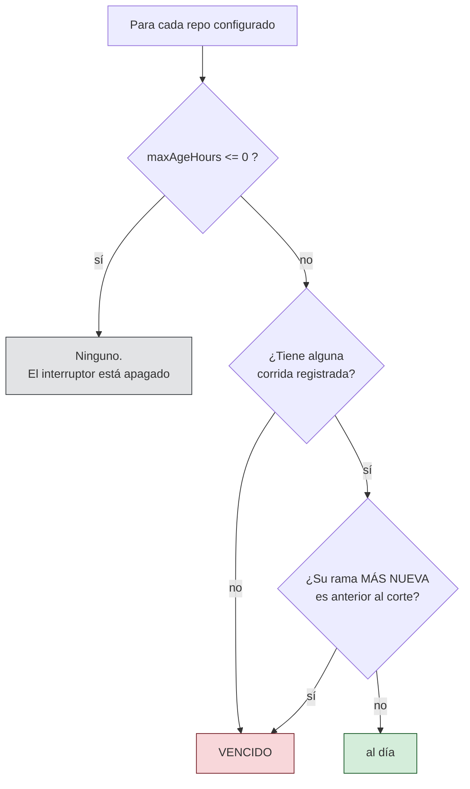

Tres decisiones dentro de ese diagrama que no son obvias:

- **Por repo, no global.** `Indexer.refresh(alias)` ya acepta un repo. Juzgar el
  índice entero por su entrada más vieja re-descargaría y re-embebería repos
  refrescados hace minutos.
- **"Nunca indexado" cuenta siempre como vencido.** Cubre dos casos: un repo
  recién agregado a `repos.json`, y un índice borrado por un bump de
  `SCHEMA_VERSION`. Los dos dejarían al usuario buscando documentación que
  sencillamente no está.
- **Se juzga por la rama MÁS NUEVA.** Las ramas se indexan juntas, así que una
  rama vieja no dice nada sobre cuándo se refrescó el repo.
- **`0` apaga de verdad.** Un interruptor de apagado que igual dispara un
  reindexado completo sobre un repo nunca indexado no está apagado.

---

## 6. El pipeline de indexado

El camino completo desde GitHub hasta SQLite. Es la parte más grande del
proyecto (`rag/indexer.ts`, 404 líneas).

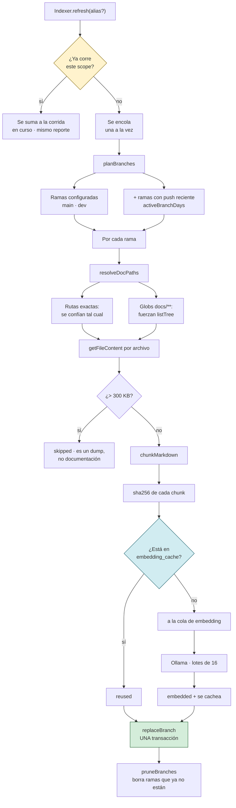

### Fallo parcial, nunca fallo total

Hay `try/catch` en **dos niveles**: por repo y por rama. Un repo caído no deja
al usuario sin índice; una rama rota no se lleva las otras. Cada fallo se
reporta en su lugar del `IndexReport` y el resto sigue.

Un caso especial que vale conocer: si un doc pattern nombra un archivo que no
existe en esa rama, eso **no es un error**. No todos los repos tienen
`NEGOCIO.md`. Se descarta en silencio (`NotFoundError`); cualquier otra cosa va
a `skipped` con el motivo.

### El single-flight vive en el Indexer

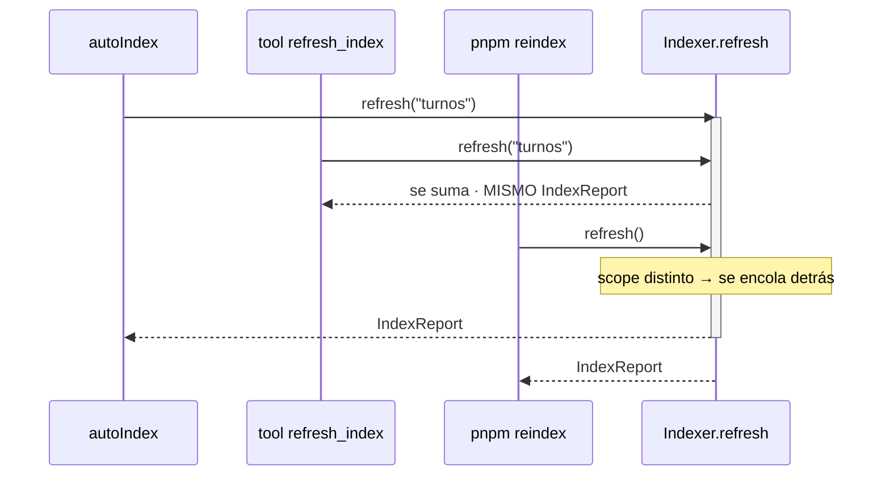

El guard está en `Indexer.refresh` y no en quien programa el refresco, y ese
detalle es la corrección de toda la pieza: el scheduler de arranque, la tool
`refresh_index` y `pnpm reindex` entran **los tres** por ese método. Un guard
puesto en cualquiera de ellos lo esquivan los otros dos, y dos corridas
concurrentes significan el doble de requests a GitHub, el doble de carga en
Ollama, y dos transacciones reescribiendo la misma rama.

Detalle de implementación que parece menor y no lo es: la entrada del mapa
`inFlight` se limpia en un `finally`, en éxito **y** en fallo. Una promesa
rechazada estacionada bajo ese scope se le entregaría a cada llamador posterior
para siempre — una sola corrida fallida desactivaría el refresco de ese repo de
manera permanente.

---

## 7. El caché de embeddings

Es la optimización con mejor relación resultado/complejidad del proyecto.

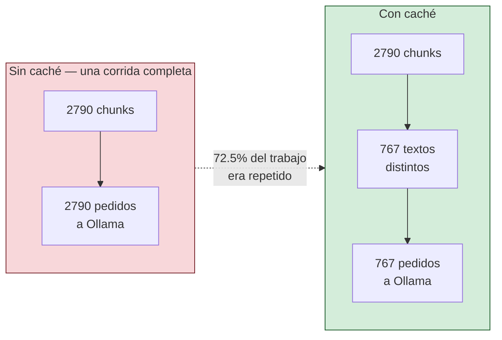

El motivo del desperdicio: `main`, `dev` y las feature branches comparten casi
todos los archivos. El mismo README se le pedía al modelo una y otra vez —
**dentro de una sola corrida**.

### Por qué se keyea por contenido y no por el `sha` del blob de git

| Criterio | Hash de contenido (elegido) | `sha` del blob |
|---|---|---|
| Granularidad | por chunk: editás una sección, se reembebe esa sección | por archivo entero |
| Rastreo por rama | no hace falta | hay que seguir archivos rama por rama |
| Invalidación | autovalidante: mismo texto → mismo vector | hay que invalidar a mano |
| Cambio en el chunker | se invalida solo | queda inconsistente en silencio |

### Y por qué el modelo es parte de la clave primaria

`PRIMARY KEY (model, content_hash)`. Acá está toda la corrección de la tabla, y
es el error que **no se puede notar desde afuera**.

Dos modelos pueden coincidir en cantidad de dimensiones — `nomic-embed-text` y
`bge-m3` coinciden. El guard por `dimensions` que usa la búsqueda no alcanzaría:
se serviría el vector de un modelo como si fuera el del otro **sin un solo
error**. El índice se vería sano, la búsqueda contestaría, y cada resultado
estaría mal en silencio.

Nada se evicta nunca. El conteo de filas está acotado por el texto distinto de
unos pocos markdown, y una política de expiración tiraría justamente las
entradas con más chance de volver a pedirse: las de una rama que reaparece.

---

## 8. La búsqueda híbrida

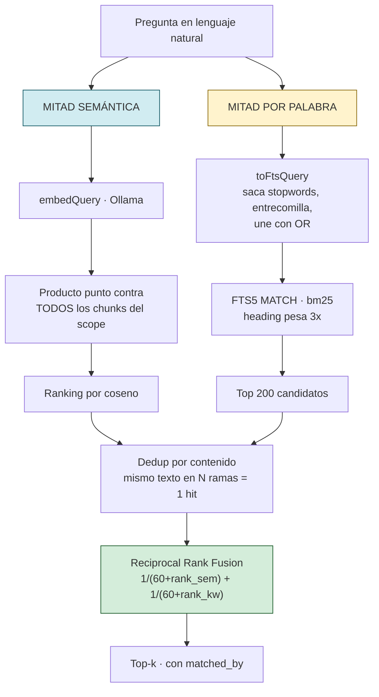

### Por qué dos motores

Ninguno alcanza solo, y fallan en consultas **distintas**:

| | hit@1 | hit@5 | suma de posiciones |
|---|---|---|---|
| semántico `nomic-embed-text` | 1/6 | 2/6 | 259 |
| semántico `bge-m3` | 2/6 | 4/6 | 114 |
| solo BM25 | 2/6 | 3/6 | 61 |
| híbrida con `nomic` | 1/6 | 3/6 | 120 |
| **híbrida con `bge-m3`** | **2/6** | **4/6** | **62** |

El semántico se pierde cuando la consulta no comparte vocabulario con el
documento. BM25 se pierde cuando la pregunta es un parafraseo, pero encuentra al
instante un token exacto y raro: `BILLING`, un número de trámite, el nombre
de una clase.

> **Salvedad honesta: n=6.** La diferencia de hit@5 entre `bge-m3` y BM25 es una
> sola pregunta. La dirección es sólida — la pregunta real sobre BILLING pasó
> del puesto 146 al 3 — pero no es una estimación precisa.

### Por qué RRF y no una suma ponderada

Un coseno y un score BM25 están en **escalas incomparables**. Normalizarlos a un
número único exige recalibrar cada vez que cambia el modelo o el corpus. RRF usa
solo la **posición** de cada resultado en su propio ranking, y los rangos no
necesitan calibración.

`RRF_K` se queda en 60 — el valor del paper original. Tres barridos
independientes dan lo mismo: entre K=0 y K=60 las tasas de acierto no se mueven.
No hay evidencia para tocarlo.

### El dedup por contenido

La clave de agrupación es `repo + path + content`, **no** `repo + path`. Es
deliberado: el mismo archivo con un cambio en una feature branch es
genuinamente una respuesta distinta y tiene que quedar separado. Pero el mismo
texto idéntico en seis ramas es **un** resultado, no seis — si no, un repo con
varias ramas activas llena el top-k entero con copias del mismo chunk.

Cada hit trae `branches[]` con todas las ramas donde aparece, ordenadas con
producción primero. Un fragmento que aparece **solo** en una feature branch es
trabajo en curso, no producción, y la tool se lo dice al agente explícitamente.

### Degradación elegante

Si la consulta no deja ningún término utilizable después de sacar stopwords, o
si la expresión MATCH sale malformada, la mitad por palabra devuelve un mapa
vacío y la búsqueda **sigue funcionando** en modo puramente semántico. Un
`catch` que devuelve `new Map()` en vez de propagar. El usuario siempre recibe
una respuesta.

---

## 9. Modelo de datos

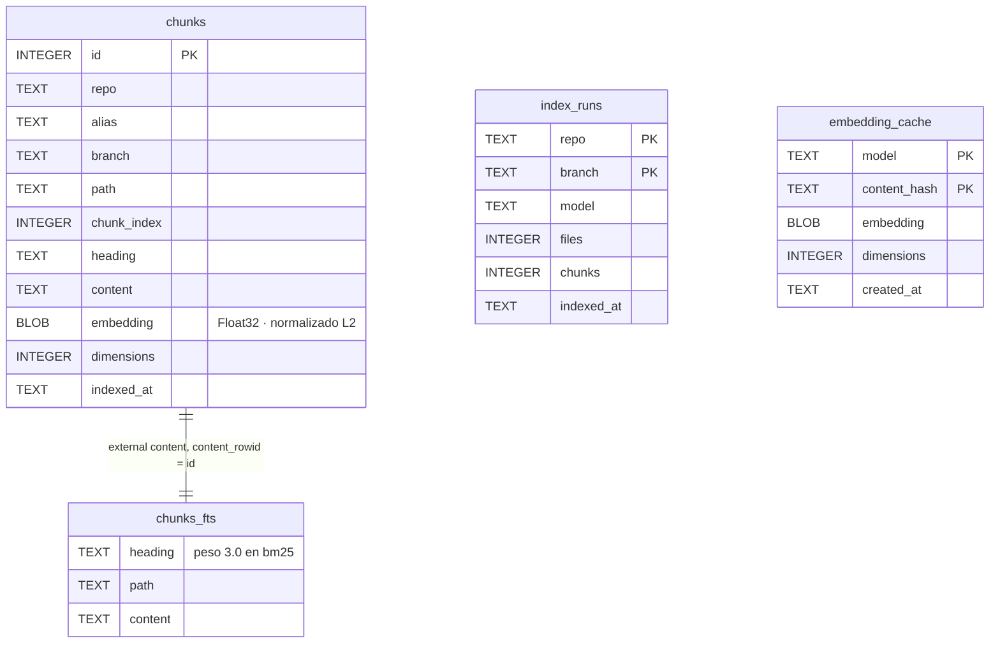

Cuatro notas sobre el esquema:

- **`chunks_fts` es una tabla de contenido externo** apuntando a `chunks.id`. El
  texto se guarda **una sola vez**. El precio es que borrar una fila necesita
  los valores originales, así que en vez de eso se hace un `rebuild` completo
  del índice FTS: una sola sentencia, imposible de desincronizar, y a unos miles
  de chunks cuesta milisegundos.

- **Los vectores se normalizan L2 al escribir**, así el coseno **es** el
  producto punto al consultar. Se leen con `readFloatLE` y no con una vista
  `Float32Array`: SQLite devuelve Buffers que son vistas sobre una asignación
  compartida y no garantizan alineación a 4 bytes, que es exactamente lo que una
  vista `Float32Array` rechaza.

- **`index_runs` es la memoria del sistema.** Es lo que lee `selectStaleRepos`
  para decidir qué está vencido.

- **El índice es un caché derivado, nunca fuente de verdad.** Por eso un cambio
  de `SCHEMA_VERSION` lo **borra** y pide un reindexado, en vez de arrastrar una
  migración frágil. Y la comprobación mira la forma real de la tabla, no
  `user_version`: la primera versión nunca estampó un número, así que un índice
  viejo lee 0 y se confundiría con una base nueva.

---

## 10. Manejo de errores

El agente tiene que poder **corregirse solo**. Para eso, un error tiene que
llegarle como texto accionable, no como un crash de transporte.

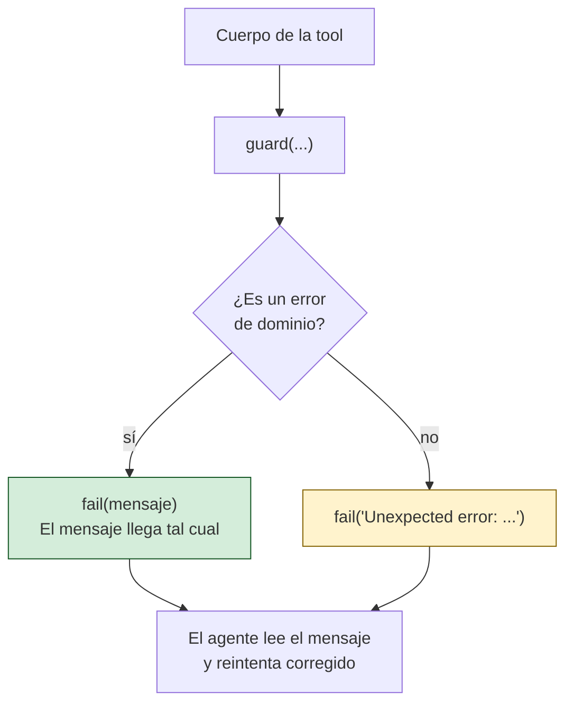

Los seis errores de dominio y qué le dicen al agente que haga:

| Error | Significa | Qué hace el agente |
|---|---|---|
| `ValidationError` | alias desconocido, query vacía, ruta mal | corrige el argumento; el mensaje lista los alias válidos |
| `NotFoundError` | no existe, o el token no lo ve | prueba otra ruta o rama |
| `RateLimitError` | límite de GitHub; trae `resetAt` | espera o cambia de estrategia |
| `PermissionError` | el token existe pero le falta permiso | no reintenta: se arregla en el token |
| `EmbeddingsUnavailableError` | Ollama caído o falta el modelo | el mensaje trae el `ollama pull` exacto |
| `IndexEmptyError` | no hay índice para ese scope | corre `refresh_index` |

El caso de `IndexEmptyError` en `search_project_docs` muestra el nivel de
cuidado que vale la pena poner acá: el mensaje distingue **tres** situaciones
distintas — el índice entero vacío, ese repo sin indexar, y esa **rama** sin
indexar — y en el tercer caso lista las ramas que **sí** están. Son tres
problemas con tres arreglos distintos, y culpar a `refresh_index` por los tres
mandaría al agente a hacer trabajo inútil.

Regla de seguridad en `core/env.ts`: los mensajes de variables faltantes nombran
**variables, nunca valores**. Una de esas variables es un token.

---

## 11. Las nueve tools

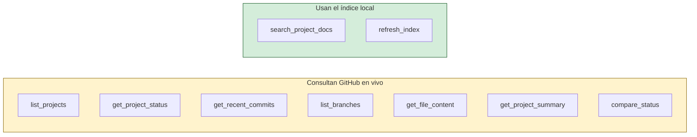

| Tool | Para qué | `readOnlyHint` |
|---|---|---|
| `list_projects` | qué repos están trackeados y con qué alias | `true` |
| `get_project_status` | estado en vivo de uno: último commit, PRs, issues | `true` |
| `get_recent_commits` | últimos commits de un repo | `true` |
| `list_branches` | ramas con su actividad | `true` |
| `get_file_content` | un archivo completo, tal cual | `true` |
| `get_project_summary` | resumen ejecutivo de un repo | `true` |
| `compare_status` | estado de varios repos en una sola llamada | `true` |
| `search_project_docs` | búsqueda híbrida sobre la documentación | `true` |
| `refresh_index` | reconstruye el índice local | `false` |

`refresh_index` es la única con `readOnlyHint: false`, y aun así **no escribe en
GitHub**: escribe `data/index.db`. Lleva además `destructiveHint: false` e
`idempotentHint: true`.

### La descripción de la tool ES la lógica de ruteo

No hay un clasificador que decida qué tool usar. **El modelo decide leyendo la
descripción.** Por eso las descripciones son largas y dicen explícitamente
cuándo NO usar la tool y con cuál se confunde. Mirá la de `search_project_docs`:
aclara que busca una foto y no GitHub en vivo, y manda a `get_project_status`
para lo otro.

Si agregás una tool, la descripción **es** el trabajo. Una descripción vaga es
un bug de ruteo.

---

## 12. Cómo se testea sin red

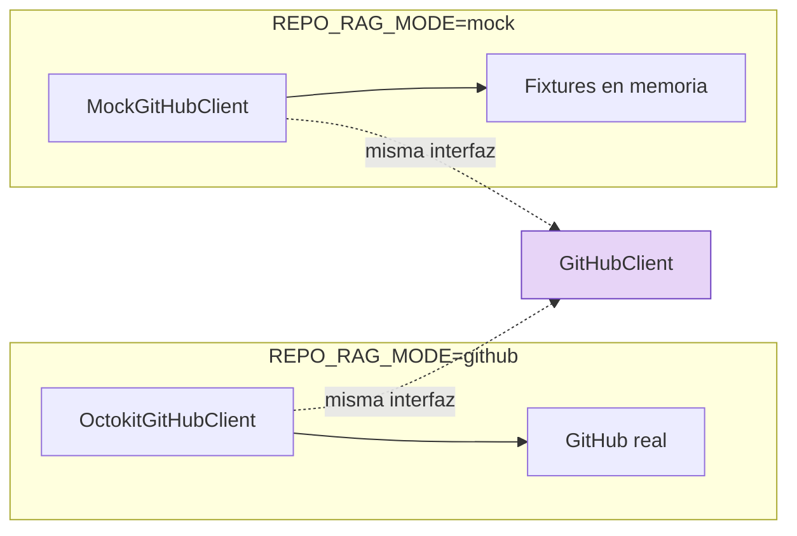

Toda la suite (`pnpm test`, `node:test`) corre **sin red y sin Ollama**. Eso es
posible por tres decisiones acumuladas:

1. `GitHubClient` es una interfaz con dos implementaciones intercambiables.
2. `chunker` y `staleness` son funciones puras.
3. `AutoIndexContext` declara **solo el pedacito** del contexto que el scheduler
   necesita — `config.all`, `store.stats()`, `indexer.refresh()` — en vez de
   pedir el `ServerContext` entero. Un test lo maneja con tres literales en vez
   de un archivo SQLite, un token y un Ollama corriendo.

El tercer punto es el más fácil de romper sin darse cuenta. Si le agregás una
dependencia al scheduler, agregala **a esa interfaz angosta**, no al contexto
global.

---

## 13. Convenciones que el código da por sentadas

- **stdout es el canal MCP.** Todo log va a `stderr` vía `console.error`. Un
  `console.log` suelto en el server **rompe el protocolo**. No es una
  preferencia de estilo.
- **Una tool por archivo**, exportando `registerX(server, context)`.
- **Errores de dominio, no excepciones crudas.**
- **Fallo parcial mejor que fallo total**, siempre.
- **Artefactos técnicos en inglés** — código, comentarios, identificadores.
  **Documentación para el equipo en español**, como este archivo.

---

## Ver también

- [`CONCEPTOS.md`](CONCEPTOS.md) — qué es RAG, embeddings y MCP, sin código.
- [`COMO_FUNCIONA.md`](COMO_FUNCIONA.md) — las tools desde el lado del usuario.
- [`INSTALACION.md`](INSTALACION.md) — puesta en marcha en Windows.
- [`../CLAUDE.md`](../CLAUDE.md) — decisiones de diseño con su justificación.
- [`../ROADMAP.md`](../ROADMAP.md) — qué entra en v1, v2 y v3.
