# Architecture

🌐 **English** | [Español](../ARQUITECTURA.md)

How the server is built on the inside: which piece does what, how they communicate
and why they are separated this way.

This document is for **whoever is going to touch the code**. If you want to
understand what an MCP or an embedding is without getting into the code, start
with [`CONCEPTS.md`](CONCEPTS.md). If you want to know what to ask the server, go
to [`HOW_IT_WORKS.md`](HOW_IT_WORKS.md).

---

## 1. The idea in one diagram

The server sits between the agent and three external resources. It has no business
database of its own, no users, no session state. It is a translator with memory.

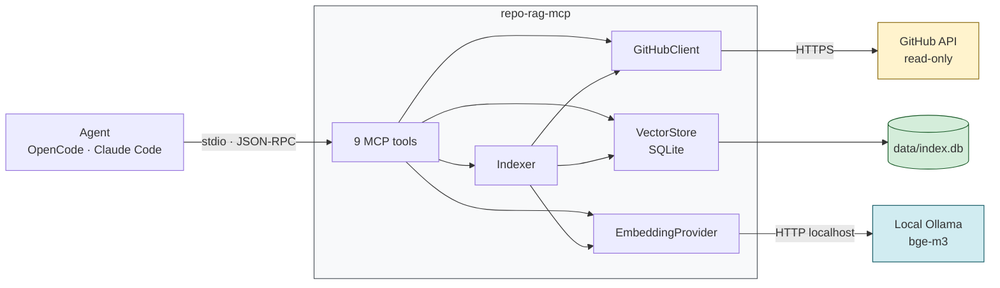

Three things this diagram already says and are worth fixing in mind:

1. **Only reads go out to GitHub.** There is no write client anywhere in the code.
   The `GitHubClient` interface (`src/github/types.ts`) exposes six methods and all
   six start with `get` or `list`. That restriction is not a convention: it is the
   shape of the type.
2. **The only thing written is `data/index.db`**, on your machine.
3. **Ollama is local.** No text from the repos leaves for a third-party service to
   be embedded.

---

## 2. The two halves of the system

Here is the distinction that is hardest when reading the code for the first time,
and without which nothing else makes sense:

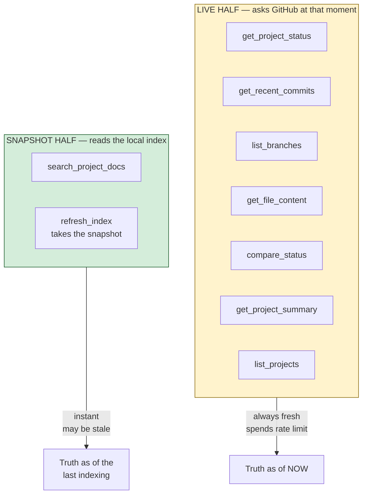

**The index is a snapshot, not a mirror.** It is the number one source of confusion
for someone who didn't build this: they ask about a document that is on GitHub, and
are told the documentation doesn't cover it. The answer isn't wrong — the document
wasn't in the snapshot.

That is the reason for the startup auto-index (section 5): it doesn't document the
manual step, it eliminates it.

---

## 3. Module map

Who depends on whom. The arrows go in the direction of the dependency.

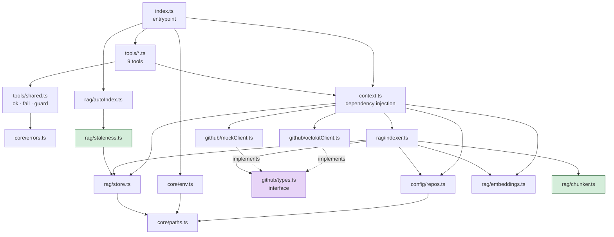

Two nodes are marked on purpose:

- **`github/types.ts` (violet)** is an interface, not an implementation. That is
  the decoupling that lets the whole test suite run **without network and without a
  token**: `MockGitHubClient` implements the same interface in memory. The wiring
  is decided in a single place, `context.ts`, by looking at `REPO_RAG_MODE`.

- **`rag/staleness.ts` and `rag/chunker.ts` (green)** are **pure functions**. They
  don't touch disk, don't touch the clock, don't touch the network.
  `selectStaleRepos(repos, stats, maxAgeHours, now)` even receives the clock as an
  argument. That's why a test can set up a complete scenario with three literals,
  without bringing up SQLite or Ollama. The effects — reading `index_runs`, looking
  at the time, spending GitHub quota — live in the scheduler that calls it, not in
  the decision.

That separation between **deciding** and **executing** is the pattern that repeats
throughout the project. If you're going to add logic, ask yourself which side it
falls on.

---

## 4. Server startup

`src/index.ts` from top to bottom:

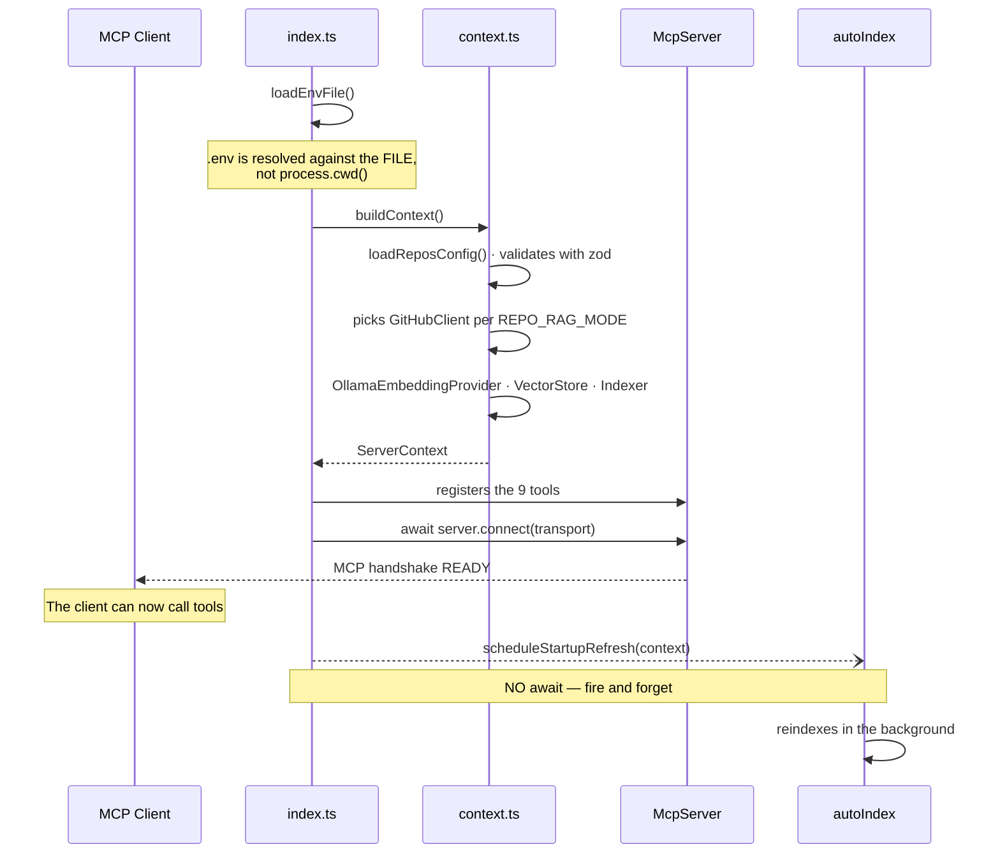

### Why `.env` is resolved against the file

`core/paths.ts` computes `PROJECT_ROOT` from `import.meta.url`, not from
`process.cwd()`. Concrete reason: the MCP client starts the server from whichever
repo you happen to be working in at that moment. A cwd-relative lookup would look
for the `.env` in the wrong project and never find it. Besides, MCP clients launch
the process over stdio **without a shell**, so the parent's environment usually
arrives empty: the `.env` next to the server is the real configuration.

### Why the auto-index is NOT awaited

The line is `void scheduleStartupRefresh(context).catch(...)`, deliberately without
`await`. If it were awaited, the MCP handshake would hang on GitHub and Ollama, and
a cold start would leave the client waiting for minutes.

Without `await`, the tools answer from the old index while the update runs behind
the scenes. A server that answers with a stale index is far better than one that
doesn't start.

That same priority explains the **three containment safety nets**:

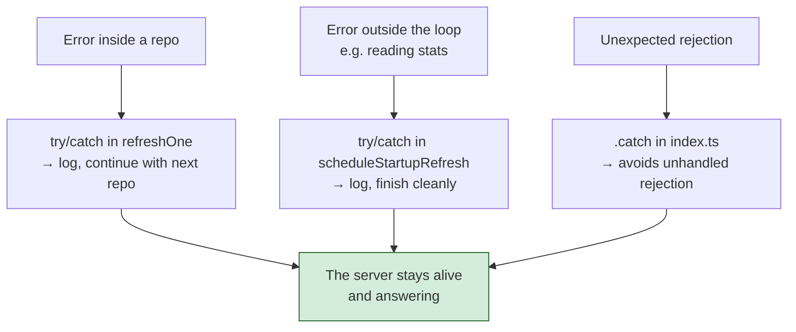

And the reason repos are processed **in sequence and never with `Promise.all`**:
parallelizing would multiply the pressure on GitHub's rate limit and on Ollama
right at the moment the agent starts asking questions, gaining nothing, because
this already runs in the background.

---

## 5. What counts as "stale"

`selectStaleRepos` decides **per repo**, not with a global flag:

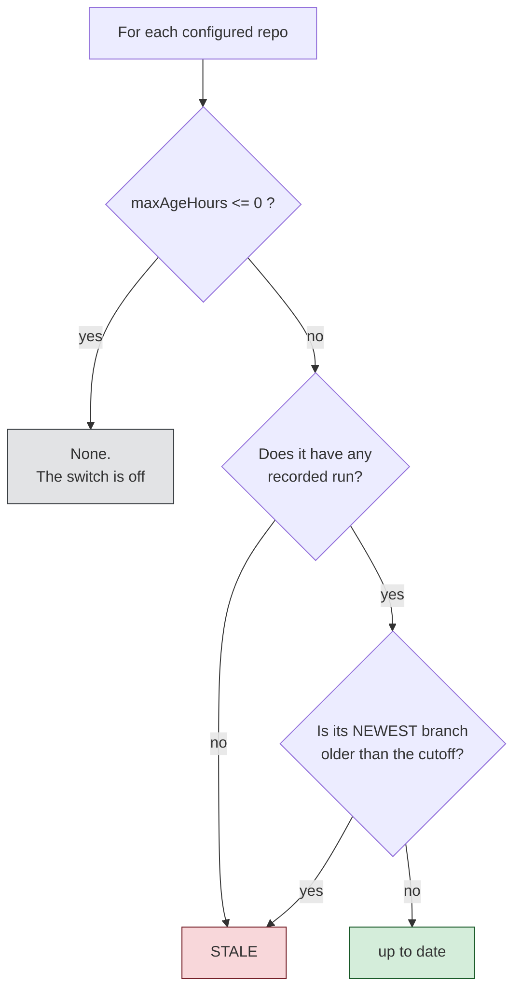

Three decisions inside that diagram that are not obvious:

- **Per repo, not global.** `Indexer.refresh(alias)` already accepts a repo.
  Judging the whole index by its oldest entry would re-download and re-embed repos
  refreshed minutes ago.
- **"Never indexed" always counts as stale.** It covers two cases: a repo just added
  to `repos.json`, and an index deleted by a `SCHEMA_VERSION` bump. Both would leave
  the user searching for documentation that simply isn't there.
- **It is judged by the NEWEST branch.** Branches are indexed together, so an old
  branch says nothing about when the repo was refreshed.
- **`0` really turns it off.** An off switch that still triggers a full reindex on a
  never-indexed repo isn't off.

---

## 6. The indexing pipeline

The full path from GitHub to SQLite. It is the biggest part of the project
(`rag/indexer.ts`, 404 lines).

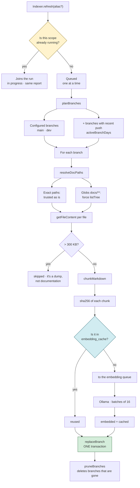

### Partial failure, never total failure

There is `try/catch` at **two levels**: per repo and per branch. A downed repo
doesn't leave the user without an index; a broken branch doesn't take the others
with it. Each failure is reported in its place in the `IndexReport` and the rest
continues.

A special case worth knowing: if a doc pattern names a file that doesn't exist on
that branch, that is **not an error**. Not every repo has a `NEGOCIO.md`. It is
silently discarded (`NotFoundError`); anything else goes to `skipped` with the
reason.

### Single-flight lives in the Indexer

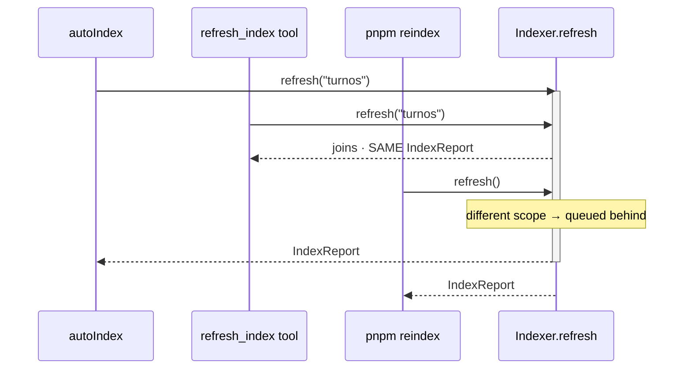

The guard is in `Indexer.refresh` and not in whoever schedules the refresh, and
that detail is the correctness of the whole piece: the startup scheduler, the
`refresh_index` tool and `pnpm reindex` **all three** enter through that method. A
guard placed in any one of them is bypassed by the other two, and two concurrent
runs mean double the requests to GitHub, double the load on Ollama, and two
transactions rewriting the same branch.

An implementation detail that seems minor and isn't: the `inFlight` map entry is
cleared in a `finally`, on success **and** on failure. A rejected promise parked
under that scope would be handed to every later caller forever — a single failed
run would permanently disable refresh for that repo.

---

## 7. The embedding cache

It is the optimization with the best result/complexity ratio in the project.

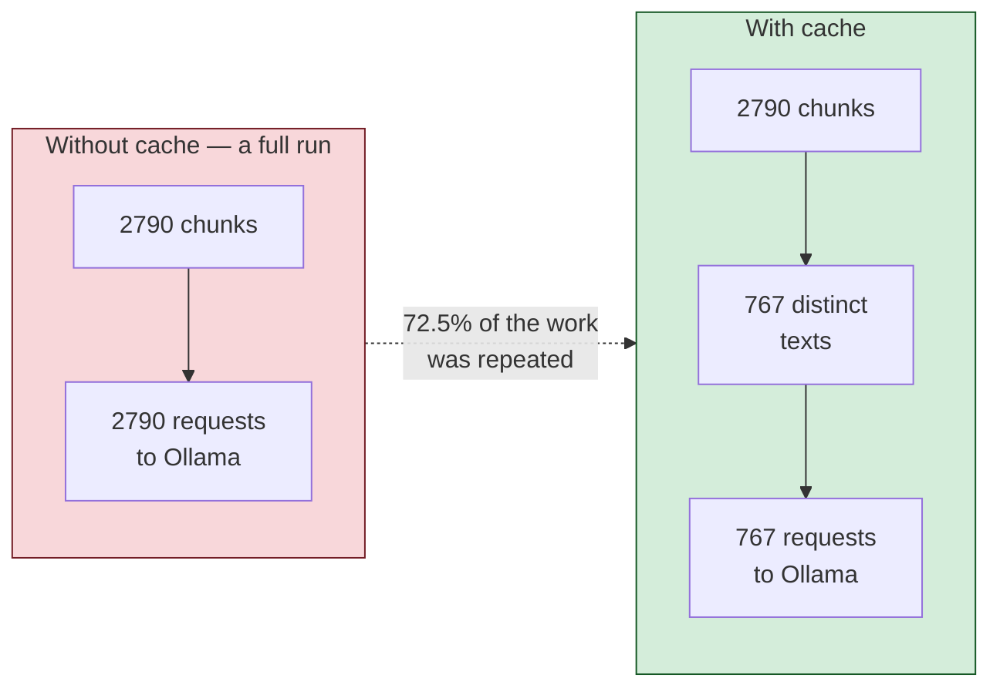

The reason for the waste: `main`, `dev` and the feature branches share almost all
their files. The same README was asked of the model over and over — **within a
single run**.

### Why it's keyed by content and not by the git blob's `sha`

| Criterion | Content hash (chosen) | Blob `sha` |
|---|---|---|
| Granularity | per chunk: you edit a section, that section is re-embedded | per whole file |
| Per-branch tracking | not needed | files must be tracked branch by branch |
| Invalidation | self-validating: same text → same vector | must be invalidated by hand |
| Change in the chunker | invalidates itself | silently left inconsistent |

### And why the model is part of the primary key

`PRIMARY KEY (model, content_hash)`. Here lies the entire correctness of the table,
and it is the error that **can't be noticed from outside**.

Two models can match in number of dimensions — `nomic-embed-text` and `bge-m3`
do. The `dimensions` guard that search uses wouldn't be enough: one model's vector
would be served as if it were the other's **without a single error**. The index
would look healthy, search would answer, and every result would be silently wrong.

Nothing is ever evicted. The row count is bounded by the distinct text of a few
markdown files, and an expiration policy would throw away precisely the entries
most likely to be requested again: those of a branch that reappears.

---

## 8. Hybrid search

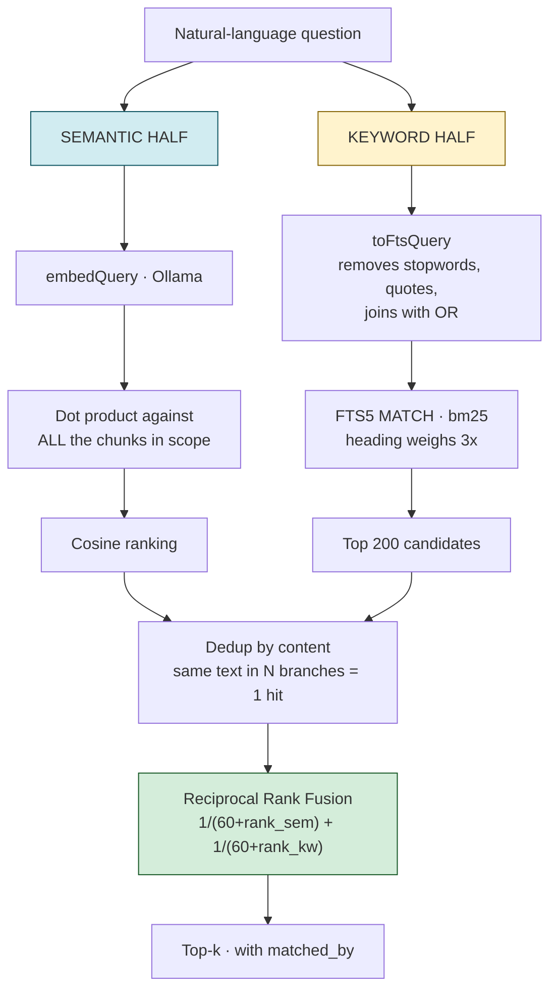

### Why two engines

Neither is enough on its own, and they fail on **different** queries:

| | hit@1 | hit@5 | sum of positions |
|---|---|---|---|
| semantic `nomic-embed-text` | 1/6 | 2/6 | 259 |
| semantic `bge-m3` | 2/6 | 4/6 | 114 |
| BM25 only | 2/6 | 3/6 | 61 |
| hybrid with `nomic` | 1/6 | 3/6 | 120 |
| **hybrid with `bge-m3`** | **2/6** | **4/6** | **62** |

The semantic engine gets lost when the query doesn't share vocabulary with the
document. BM25 gets lost when the question is a paraphrase, but instantly finds an
exact and rare token: `BILLING`, a case number, the name of a class.

> **Honest caveat: n=6.** The hit@5 difference between `bge-m3` and BM25 is a
> single question. The direction is solid — the real BILLING question went from
> position 146 to 3 — but it is not a precise estimate.

### Why RRF and not a weighted sum

A cosine and a BM25 score are on **incomparable scales**. Normalizing them to a
single number requires recalibrating every time the model or the corpus changes.
RRF uses only the **position** of each result in its own ranking, and ranks need no
calibration.

`RRF_K` stays at 60 — the value from the original paper. Three independent sweeps
give the same result: between K=0 and K=60 the hit rates don't move. There is no
evidence to touch it.

### Dedup by content

The grouping key is `repo + path + content`, **not** `repo + path`. It is
deliberate: the same file with a change on a feature branch is genuinely a
different answer and has to stay separate. But the same identical text on six
branches is **one** result, not six — otherwise a repo with several active branches
fills the entire top-k with copies of the same chunk.

Each hit carries `branches[]` with all the branches where it appears, ordered with
production first. A fragment that appears **only** on a feature branch is work in
progress, not production, and the tool tells the agent so explicitly.

### Graceful degradation

If the query leaves no usable term after removing stopwords, or if the MATCH
expression comes out malformed, the keyword half returns an empty map and the
search **keeps working** in purely semantic mode. A `catch` that returns
`new Map()` instead of propagating. The user always gets an answer.

---

## 9. Data model

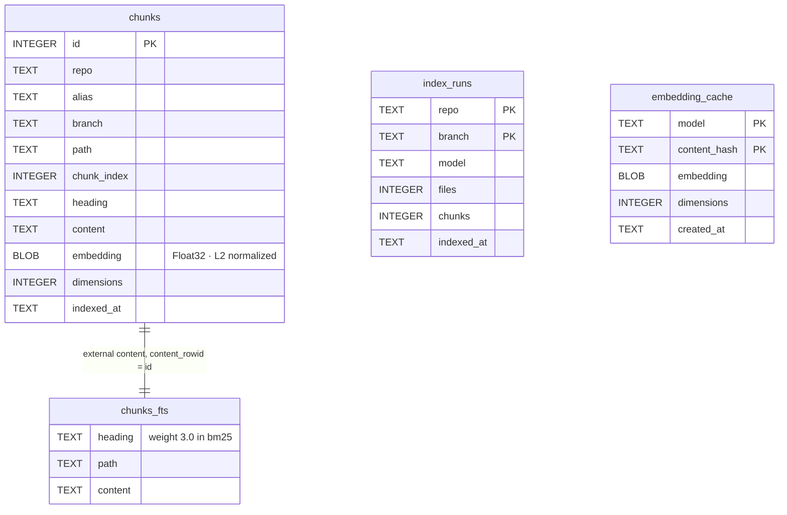

Four notes on the schema:

- **`chunks_fts` is an external-content table** pointing to `chunks.id`. The text
  is stored **only once**. The price is that deleting a row needs the original
  values, so instead a full `rebuild` of the FTS index is done: a single statement,
  impossible to get out of sync, and at a few thousand chunks it costs
  milliseconds.

- **Vectors are L2-normalized on write**, so the cosine **is** the dot product at
  query time. They are read with `readFloatLE` and not with a `Float32Array` view:
  SQLite returns Buffers that are views over a shared allocation and don't
  guarantee 4-byte alignment, which is exactly what a `Float32Array` view rejects.

- **`index_runs` is the system's memory.** It is what `selectStaleRepos` reads to
  decide what is stale.

- **The index is a derived cache, never a source of truth.** That's why a
  `SCHEMA_VERSION` change **deletes** it and asks for a reindex, instead of carrying
  a fragile migration. And the check looks at the real shape of the table, not
  `user_version`: the first version never stamped a number, so an old index reads 0
  and would be confused with a new database.

---

## 10. Error handling

The agent has to be able to **correct itself**. For that, an error has to reach it
as actionable text, not as a transport crash.

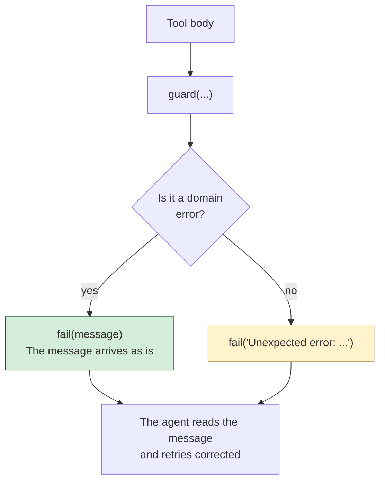

The six domain errors and what they tell the agent to do:

| Error | Means | What the agent does |
|---|---|---|
| `ValidationError` | unknown alias, empty query, bad path | corrects the argument; the message lists the valid aliases |
| `NotFoundError` | doesn't exist, or the token can't see it | tries another path or branch |
| `RateLimitError` | GitHub limit; carries `resetAt` | waits or changes strategy |
| `PermissionError` | the token exists but lacks permission | doesn't retry: it is fixed in the token |
| `EmbeddingsUnavailableError` | Ollama down or the model is missing | the message carries the exact `ollama pull` |
| `IndexEmptyError` | there is no index for that scope | runs `refresh_index` |

The `IndexEmptyError` case in `search_project_docs` shows the level of care worth
putting in here: the message distinguishes **three** different situations — the
whole index empty, that repo not indexed, and that **branch** not indexed — and in
the third case it lists the branches that **are** there. They are three problems
with three different fixes, and blaming `refresh_index` for all three would send
the agent off to do useless work.

Security rule in `core/env.ts`: messages about missing variables name
**variables, never values**. One of those variables is a token.

---

## 11. The nine tools

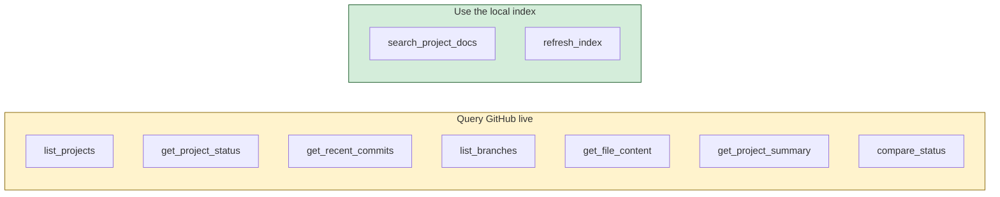

| Tool | What for | `readOnlyHint` |
|---|---|---|
| `list_projects` | which repos are tracked and with what alias | `true` |
| `get_project_status` | live status of one: latest commit, PRs, issues | `true` |
| `get_recent_commits` | latest commits of a repo | `true` |
| `list_branches` | branches with their activity | `true` |
| `get_file_content` | a complete file, as is | `true` |
| `get_project_summary` | executive summary of a repo | `true` |
| `compare_status` | status of several repos in a single call | `true` |
| `search_project_docs` | hybrid search over the documentation | `true` |
| `refresh_index` | rebuilds the local index | `false` |

`refresh_index` is the only one with `readOnlyHint: false`, and even so it **does
not write to GitHub**: it writes `data/index.db`. It also carries
`destructiveHint: false` and `idempotentHint: true`.

### The tool description IS the routing logic

There is no classifier deciding which tool to use. **The model decides by reading
the description.** That's why the descriptions are long and explicitly say when NOT
to use the tool and which one it gets confused with. Look at the one for
`search_project_docs`: it makes clear that it searches a snapshot and not live
GitHub, and points to `get_project_status` for the other case.

If you add a tool, the description **is** the work. A vague description is a
routing bug.

---

## 12. How it's tested without network

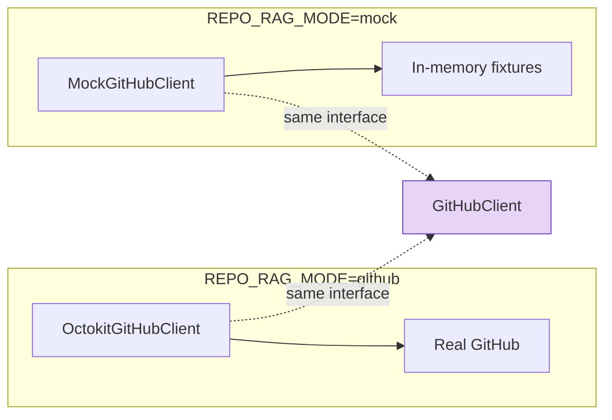

The whole suite (`pnpm test`, `node:test`) runs **without network and without
Ollama**. That is possible thanks to three accumulated decisions:

1. `GitHubClient` is an interface with two interchangeable implementations.
2. `chunker` and `staleness` are pure functions.
3. `AutoIndexContext` declares **only the small piece** of the context the scheduler
   needs — `config.all`, `store.stats()`, `indexer.refresh()` — instead of asking
   for the entire `ServerContext`. A test drives it with three literals instead of
   a SQLite file, a token and a running Ollama.

The third point is the easiest to break without noticing. If you add a dependency
to the scheduler, add it **to that narrow interface**, not to the global context.

---

## 13. Conventions the code takes for granted

- **stdout is the MCP channel.** All logging goes to `stderr` via `console.error`. A
  stray `console.log` in the server **breaks the protocol**. It is not a style
  preference.
- **One tool per file**, exporting `registerX(server, context)`.
- **Domain errors, not raw exceptions.**
- **Partial failure better than total failure**, always.
- **Technical artifacts in English** — code, identifiers. **Team documentation in
  Spanish**, like the original of this file (this English version is a
  translation).

---

## See also

- [`CONCEPTS.md`](CONCEPTS.md) — what RAG, embeddings and MCP are, without code.
- [`HOW_IT_WORKS.md`](HOW_IT_WORKS.md) — the tools from the user's side.
- [`INSTALLATION.md`](INSTALLATION.md) — getting started on Windows.
- [`../../CLAUDE.md`](../../CLAUDE.md) — design decisions with their justification.
- [`ROADMAP.md`](ROADMAP.md) — what goes into v1, v2 and v3.
